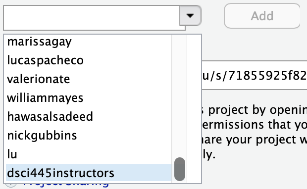

# hw-1

Homework 1 in DSCI445: Statistical Machine Learning @ CSU

## Assignment

### Part 1 - R & ggplot2
The diamonds data set is part of the `ggplot2` package. You can access it via the following code

```{r, eval=FALSE}
# you might need to install the ggplot2 package first
# install.packages("ggplot2")

# load the ggplot2 library
library(ggplot2)

data(diamonds)
head(diamonds) 

# ---------------------------------------------
# use help to get more information on the data
help(diamonds)
```

This week, we are going to investigate the `diamonds` data set a bit. In particular, we are interested in the data quality.

Write a short report describing problems with the diamonds data. The report is supposed to be written entirely in `R`, i.e. you should be able to copy and paste your report into `R` and run it to get the results (and this is what we will do for the grading).

Use the skills you have learned in class to find interesting subsets and graphics which reveal problems with the data. To find problems you will need to use your common sense, and your knowledge of the data. Start by looking for unusual diamonds on each variable individually, and then on combinations of the variables. You might want to create new variables. 

Create graphical summaries of the data using what we've learned in class and `ggplot2` and describe your findings. 

### Part 2 - Regression

The `MASS` package contains a data set called `Boston` which records median house value (`medv`) for $506$ neighborhoods around Boston. We will seek to predict median house value using 13 predictors, such as average rooms per house (`rm`), average age of houses (`age`), and percent of households with low socioeconomic status (`lstat`). 

Start by visually inspecting the data to get an idea of relationships that might be present (**hint:** look into the `ggpairs` function in the `GGally` package.). Describe what you see.

Next fit linear models using the `lm()` function:

(a) For each predictor fit a simple linear regression model to predict the response. Describe your results. In which of the models is there a statistically significant association between the predictor and the response?

(b) Fit a multiple regression model to predict the response using all of the predictors. Describe your results (including diagnostic plots). For which predictors can we reject the null hypothesis $H_0: \beta_j = 0$?

(c) How do your results from (a) compare to your results from (b)? Create a plot displaying the univariate regression coefficients from (a) on the $x$-axis and the multiple regression coefficients from (b) on the $y$-axis. That is, each predictor is displayed as a single point on the plot. Its coefficient in a simple linear regression model is shown as its $x$ coordinate and its coefficient in a multiple linear regression model is shown as its $y$ coordinate. Describe what you see.

 
Turn in in a pdf of your analysis to canvas using the provided Rmd file as a template. Your Rmd file on the server will also be used in grading, so be sure they are identical.

**Be sure to share your server project with the instructor and grader. You only need to do this once per semester.**

1. Open your `homeworks` project on liberator.stat.colostate.edu
2. Click the drop down on the project (top right side) > Share Project...
    
    ```{r, echo=FALSE, out.width="25%"}
    knitr::include_graphics("share_project.png")
    ```
  
3. Click the drop down and add "dsci445instructors" to your project.

    ```{r, echo=FALSE, out.width="25%"}
    
    ```

This is how you **receive points** for reproducibility on your homework!


